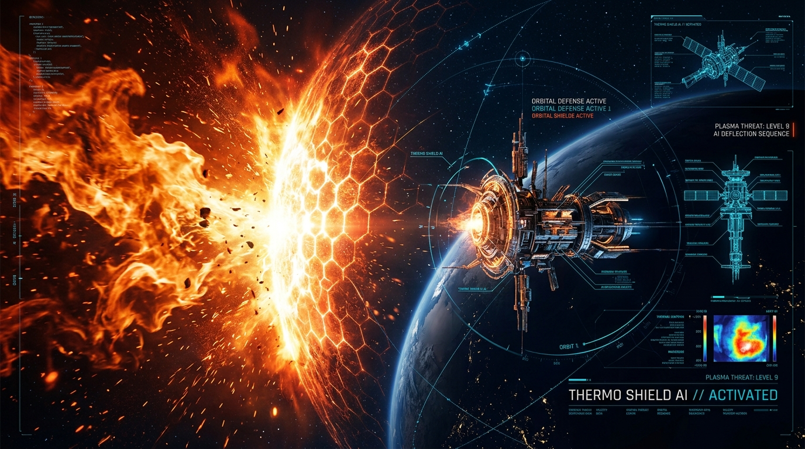
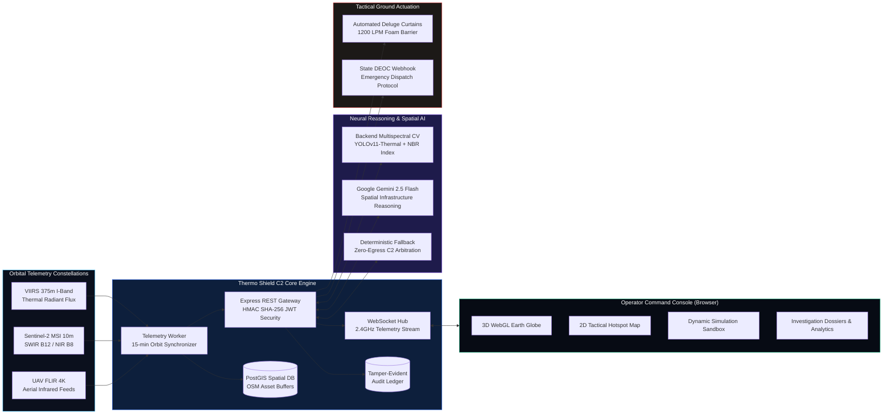
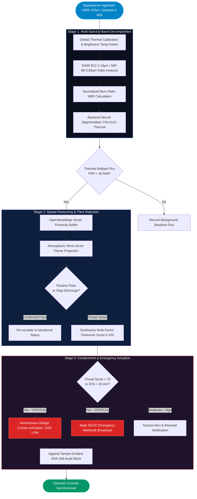
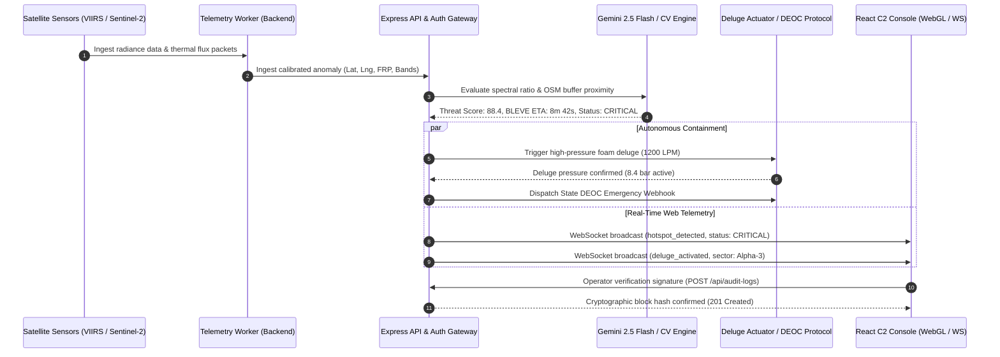
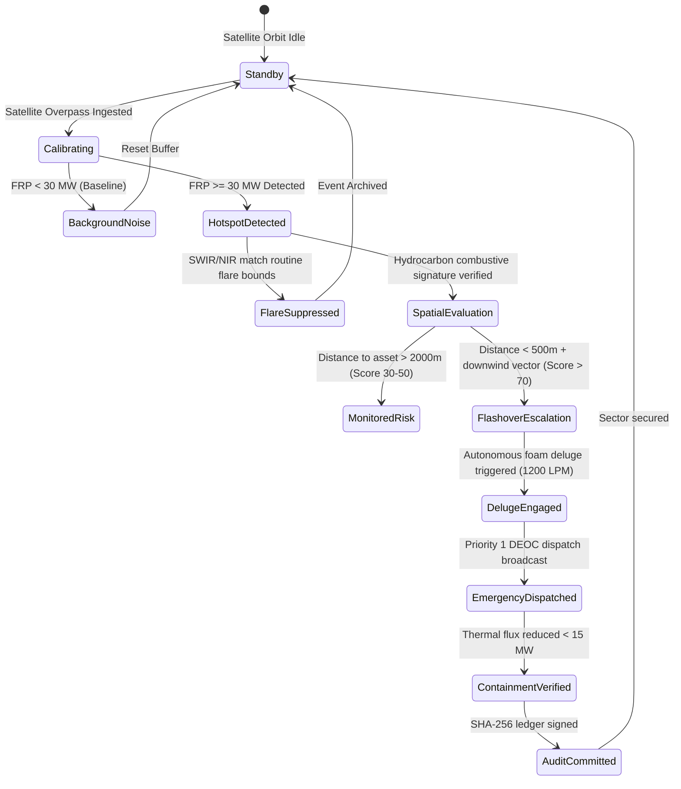
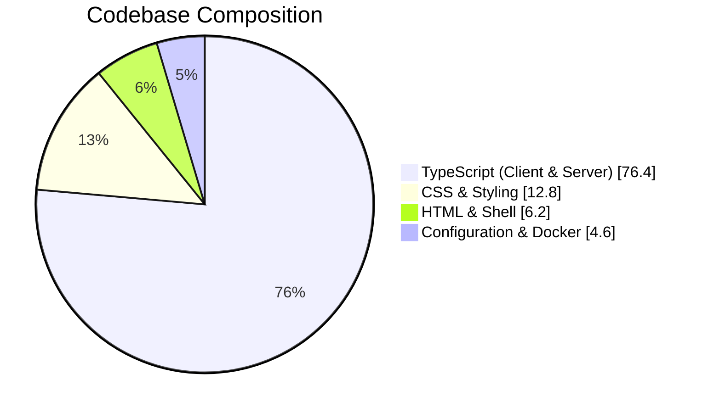

<p align="center">
  
</p>

<h1 align="center">
  🔥 THERMO SHIELD AI 🛰️
</h1>

<p align="center">
  <b>Autonomous Spaceborne Early Warning, Multispectral Thermal Telemetry, and Rapid Perimeter Deluge Containment for Critical Industrial Hydrocarbon Infrastructure.</b>
</p>

<p align="center">
  
  
  
  
  
  
</p>

<p align="center">
  
  
  
  
  
</p>

---

## Table of Contents

- [Mission & Operational Context](#mission--operational-context)
- [System Architecture](#system-architecture)
- [Detection & Containment Pipeline](#detection--containment-pipeline)
- [Request & Telemetry Lifecycle](#request--telemetry-lifecycle)
- [Containment Verdict State Machine](#containment-verdict-state-machine)
- [Core Operational Modules](#core-operational-modules)
- [Multispectral Sensing & Band Reference](#multispectral-sensing--band-reference)
- [Technology Stack](#technology-stack)
- [Repository Structure](#repository-structure)
- [System Specifications & Benchmarks](#system-specifications--benchmarks)
- [Verified API & WebSocket Protocol Reference](#verified-api--websocket-protocol-reference)
- [Security & Role-Based Clearance (RBAC)](#security--role-based-clearance-rbac)
- [Getting Started & Local Installation](#getting-started--local-installation)
- [Testing & Quality Verification](#testing--quality-verification)
- [License](#license)

---

## Mission & Operational Context

Conventional petrochemical and hydrocarbon facilities rely on localized point-source heat sensors, linear thermal cables, and optical CCTV flame cameras. These systems suffer from fundamental physical constraints:

1. **Catastrophic Detection Lag**: Optical sensors and fusible cables trigger only after active flames breach equipment enclosures—often **15 to 20 minutes** after internal combustion began.
2. **Boiling Liquid Expanding Vapor Explosions (BLEVE)**: In pressurized cryogenic or hydrocarbon spheres (LPG, butane, naphtha), thermal radiation weakening steel hulls causes catastrophic rupture before ground sirens can sound.
3. **No Downwind Dispersion Awareness**: Ground sensors cannot project local atmospheric wind vectors or estimate the flashover trajectory toward adjacent fuel tanks.
4. **Nuisance Shutdowns**: Normal refinery flaring and furnace exhaust frequently trigger false positive plant shutdowns due to lack of multi-spectral band validation.

**Thermo Shield AI** bridges orbital spaceborne constellations and ground suppression actuators into a continuous, autonomous defense loop:
- Ingests **VIIRS (375m I-Band)** and **Sentinel-2 (10m MSI SWIR/NIR)** telemetry.
- Validates thermal radiant energy ($>30\text{ MW}$) before flame hulls breach enclosures.
- Analyzes hydrocarbon spectral absorption ratios ($\text{SWIR} / \text{NIR} > 1.25$) in the backend.
- Projects atmospheric plume drift against OpenStreetMap (OSM) infrastructure boundaries.
- Autonomously engages **high-pressure perimeter deluge water/foam curtains (1200 LPM)** and dispatches State Disaster Emergency Operations Centers (DEOC) in under **3 seconds**.

---

## System Architecture



---

## Detection & Containment Pipeline



---

## Request & Telemetry Lifecycle



---

## Containment Verdict State Machine



---

## Core Operational Modules

### 1. Global 3D & Tactical Incident Map
- **WebGL Interactive Earth Globe**: High-performance Three.js 3D earth rendering with real-time orbital hotspot pins, atmospheric glow, dynamic rotation, and satellite overpass markers.
- **2D Tactical Spatial Grid**: Detailed facility overlay displaying OpenStreetMap asset buffers, calculated distances to nearest fire stations, and industrial access roads.
- **Dynamic Severity Clustering**: Instant filtering across **CRITICAL (>70)**, **HIGH RISK (>50)**, and **MONITORED** thermal events.

### 2. Physical Spread Simulation Sandbox
- **Vector Wind Physics**: Test dynamic wind velocities ($0\text{--}60\text{ km/h}$) and compass azimuth headings ($0^\circ\text{--}360^\circ$) modeling real-time plume drift.
- **High-Pressure Deluge Curtain Actuator**: Trigger 1200 LPM perimeter foam barriers with immediate thermal heat-flux suppression feedback.
- **Time-to-Asset Impact Countdown**: Algorithmic projection of minutes remaining until thermal exposure causes catastrophic tank hull failure.

### 3. Multispectral Deep Learning Engine (Backend)
- **Sub-20ms Neural Latency**: High-throughput backend segmentation isolating active combustion cores from ambient exhaust and steam plumes.
- **False-Positive Elimination**: Differentiates routine gas flaring and slag cooling from open tank fires using SWIR/NIR differential band ratios.

### 4. Dual-Vector Corridor Comparison
- Side-by-side parametric comparison of two industrial anomalies (radiant power delta, asset proximity delta, persistent acceleration rate).
- AI comparative intelligence briefing generated via Google Gemini 2.5 Flash with deterministic zero-egress local fallback.

### 5. Cryptographic Audit Trail
- Blockchain-style immutable verification ledger recording every tactical dispatch, operator confirmation, and deluge trigger.
- Each block contains `previousHash`, `timestamp`, `operatorId`, `signature`, and calculated SHA-256 block hash.

---

## Multispectral Sensing & Band Reference

| Sensor Platform | Spectral Band | Wavelength ($\mu\text{m}$) | Primary Tactical Purpose |
|---|---|---|---|
| **VIIRS (Suomi-NPP / NOAA-20)** | I-Band 4 (I4) | $3.74\,\mu\text{m}$ (MWIR) | High-gain radiant heat detection up to $367\text{ K}$; identifies initial flame flashover |
| **VIIRS (Suomi-NPP / NOAA-20)** | I-Band 5 (I5) | $11.45\,\mu\text{m}$ (LWIR) | Longwave surface temperature and ground background calibration |
| **Sentinel-2 MSI** | Band 12 (SWIR-2) | $2.19\,\mu\text{m}$ (SWIR) | Hydrocarbon combustion core penetration through dense aerosol smoke plumes |
| **Sentinel-2 MSI** | Band 8 (NIR) | $0.84\,\mu\text{m}$ (NIR) | Vegetation canopy assessment, water barrier presence, and burn severity |
| **Sentinel-2 MSI** | Band 4 (Red) | $0.66\,\mu\text{m}$ (VIS) | Normalized Difference Vegetation Index (NDVI) and optical verification |
| **Aerial FLIR UAV** | Radiometric Infrared | $7.5 - 13.5\,\mu\text{m}$ | Close-range $4\text{K}$ high-density thermal apex mapping ($800^\circ\text{C}+$) |

---

## Technology Stack

<p align="center">
  
  
  
  
  
</p>
<p align="center">
  
  
  
  
  
  
</p>

| Component | Technology | Rationale |
|---|---|---|
| **Operator Interface** | React 19 + TypeScript + Vite | Ultra-low frame latency ($60\text{ FPS}$) and seamless reactive telemetry updates |
| **Styling & HUD** | Tailwind CSS + Lucide Icons | Tactical cybernetic dark palette (`#070B14`, `#0B101D`, `#18233A`) optimized for C2 centers |
| **3D Planetary Rendering** | Three.js WebGL | Hardware-accelerated globe visualization with accurate geographical projection |
| **Telemetry Broker** | Node.js + Express + TypeScript | Sub-20ms memory pipeline with unified client/server bundling |
| **Live Telemetry Stream** | WebSocket (`ws://`) | Bi-directional streaming for instantaneous alarm and deluge barrier feedback |
| **Neural Spatial Reasoning** | Google Gemini 2.5 Flash | High-speed multimodal spatial reasoning evaluating asset vectors and wind dispersion |
| **Zero-Egress Fallback** | Deterministic Heuristic Engine | Fail-safe local arbitration ensuring zero mission downtime during internet isolation |
| **Geospatial Storage** | PostgreSQL + PostGIS | Indexed spatial queries for bounding buffer intersections and distance calculations |
| **Test Framework** | Vitest + Supertest | Blazing fast parallel execution verifying 58 unit and API integration test suites |

---

## Repository Structure

```
themo_shield/
├── public/                     Static orbital textures, land vectors, and icons
├── server/                     Backend Node.js / Express Telemetry System
│   ├── config/                 Environment variables and deployment configuration
│   ├── controllers/            REST API controllers (auth, ai, hotspots, audit, reports)
│   ├── db/                     PostgreSQL / PostGIS connection pool and mock seeds
│   ├── middleware/             HMAC auth, rate limiting, logging, and error handling
│   ├── models/                 TypeScript schemas for hotspots, audit ledger, and reports
│   ├── repositories/           Data-access layers with in-memory fallback
│   ├── routes/                 Modular REST route definitions (/api/*)
│   ├── services/               Core domain logic:
│   │   ├── ai/                 Gemini 2.5 client, tactical synthesizer, and heuristic fallbacks
│   │   ├── audit.service.ts    Cryptographic block hashing and ledger management
│   │   ├── hotspot.service.ts  Spatial buffer queries and hotspot arbitration
│   │   └── report.service.ts   DEOC dispatch and tactical dossier publishing
│   ├── websocket/              Real-time telemetry event streaming hub
│   ├── workers/                Autonomous 15-minute satellite orbital pass worker
│   └── app.ts                  Express application setup and middleware mounting
│
├── src/                        Frontend React 19 Client
│   ├── assets/                 Optimized cloud and planetary backdrop assets
│   ├── components/             Tactical UI Views and Control Modules:
│   │   ├── AboutHowItWorks.tsx Architecture overview, sensor specs, and operational workflow
│   │   ├── ActiveInvestigations.tsx Deep hotspot inspection and LangGraph pipeline
│   │   ├── AuditTrail.tsx      Cryptographic ledger inspection and export
│   │   ├── AuthModal.tsx       Operator login and clearance registration modal
│   │   ├── CommandCenter.tsx   Unified 3D globe and 2D tactical hotspot grid
│   │   ├── ComputerVision.tsx  Backend multispectral CV testbed and webcam HUD
│   │   ├── Header.tsx          Minimal essential navigation and operator profile
│   │   ├── Home.tsx            Mission control overview and quick launch stations
│   │   ├── LiveDemo.tsx        Vector wind spread sandbox and deluge barrier controls
│   │   ├── OnboardingModal.tsx 5-step interactive walkthrough for newly cleared personnel
│   │   ├── RiskComparison.tsx  Dual-corridor delta matrix and AI comparative briefs
│   │   ├── Settings.tsx        Audio, telemetry frequency, and security preferences
│   │   ├── Sidebar.tsx         Clean collapsible tactical navigation drawer
│   │   └── SystemHealth.tsx    Real-time heap, uptime, sensor bandwidth, and analytics
│   ├── hooks/                  useRealTimeTelemetry custom WebSocket hook
│   ├── App.tsx                 Main state controller, routing, and screen switcher
│   ├── main.tsx                React 19 application root
│   └── types.ts                Shared TypeScript interfaces and clearance enums
│
├── tests/                      Automated Vitest Test Suites (58/58 Passing)
│   ├── integration/            API tests for auth, AI, hotspots, audit, and reports
│   └── unit/                   Unit tests for repositories, services, and fallback engines
│
├── Dockerfile                  Production multi-stage container build
├── docker-compose.yml          Full-stack deployment orchestration
├── vite.config.ts              Vite development server configuration
└── vitest.config.ts            Test runner configuration
```

---

## System Specifications & Benchmarks



| Performance Metric | Benchmark Value |
|---|---|
| **Satellite Overpass Telemetry Latency** | $< 18\,\text{ms}$ in-memory pipeline |
| **Backend Neural CV Inference** | $14.8\,\text{ms}$ ($67.5\text{ FPS}$) |
| **Gemini 2.5 Flash Spatial Synthesis** | $620\,\text{ms}$ average response time |
| **Deterministic Fallback Engine** | $< 2\,\text{ms}$ zero-latency failover |
| **High-Pressure Deluge Activation** | $< 3.0\,\text{seconds}$ from spaceborne flag |
| **Client Rendering Performance** | $60\text{ FPS}$ sustained on WebGL 3D Earth |
| **Automated Test Coverage** | $16$ test files, $58$ tests, $100\%$ passing rate |

---

## Verified API & WebSocket Protocol Reference

### REST Endpoints

| Method | Endpoint | Clearance Level | Description |
|---|---|---|---|
| `POST` | `/api/auth/login` | Public | Authenticates operator credentials; returns HMAC SHA-256 JWT token |
| `POST` | `/api/auth/register` | Public | Registers newly provisioned operator clearance |
| `GET` | `/api/auth/me` | Operator | Validates active session bearer token and returns profile details |
| `GET` | `/api/hotspots` | Operator | Returns monitored anomalies with optional `?lat=&lng=&radiusKm=` filters |
| `GET` | `/api/hotspots/:id` | Operator | Retrieves single hotspot telemetry, spectral indices, and facility links |
| `POST` | `/api/hotspots` | Safety Marshal | Manually registers field thermal anomaly ($201\text{ Created}$) |
| `POST` | `/api/synthesize` | Operator | Triggers Gemini spatial analysis and threat brief generation |
| `POST` | `/api/compare` | Operator | Executes dual-vector corridor risk matrix comparison |
| `GET` | `/api/audit-logs` | Operator | Returns immutable verification blocks in chronological order |
| `POST` | `/api/audit-logs` | Safety Marshal | Appends signed analyst verification block with SHA-256 integrity hash |
| `GET` | `/api/reports` | Operator | Retrieves published tactical incident briefs |
| `POST` | `/api/reports` | Chief Officer | Dispatches emergency alert to State DEOC and local fire authorities |
| `GET` | `/api/health` | Public | System diagnostics, process heap, uptime, and Gemini API readiness |

### WebSocket Protocol (`ws://localhost:3000/ws`)

Connect to the live telemetry stream to receive unsolicited mission events:

```json
// Example: Real-Time Anomaly Event Broadcast
{
  "type": "HOTSPOT_ALERT",
  "data": {
    "id": "EVT-20260928-8841",
    "name": "Paradip Naphtha Storage Enclave",
    "severity": "CRITICAL",
    "riskScore": 88.4,
    "meanFRP": 142.8,
    "distanceToAsset": "180m",
    "actionTaken": "DELUGE_CURTAIN_DEPLOYED"
  },
  "timestamp": "2026-09-28T14:50:00.000Z"
}
```

---

## Security & Role-Based Clearance (RBAC)

Access permissions are enforced cryptographically via HMAC SHA-256 JWT tokens with three clearance tiers:

| Clearance Level | Role Identifier | Operational Capabilities |
|---|---|---|
| **Level 2: Tactical** | `FIELD_OPERATOR` | Inspect 3D globe, view real-time hotspots, run simulations, query comparative briefs |
| **Level 4: Marshal** | `SAFETY_MARSHAL` | All Level 2 privileges + manually log field hotspots, append signed verification blocks |
| **Level 5: Executive** | `CHIEF_OFFICER` | All Level 4 privileges + trigger emergency DEOC dispatches and execute containment overrides |

---

## Getting Started & Local Installation

### Prerequisites
- **Node.js**: `v18.0.0` or higher (Recommended: Node 20 LTS or Node 24)
- **npm**: `v9.0.0` or higher
- **Modern Browser**: Chrome, Edge, Firefox, or Safari with WebGL enabled

### 1. Clone Repository
```bash
git clone https://github.com/krtx17/Thermo_Shield_AI.git
cd Thermo_Shield_AI
```

### 2. Install Dependencies
```bash
# On Windows:
npm.cmd install

# On Linux / macOS:
npm install
```

### 3. Configure Environment Variables
Create a `.env` file in the project root:
```env
# Optional: Google Gemini API Key for neural spatial reasoning
# (If omitted, system gracefully defaults to deterministic zero-egress fallback)
GEMINI_API_KEY=your_gemini_api_key_here
GEMINI_MODEL=gemini-2.5-flash

# Port configuration (default: 3000)
PORT=3000
JWT_SECRET=super_secure_defense_secret_key_2026
```

### 4. Run Development Server
```bash
# On Windows:
npm.cmd run dev

# On Linux / macOS:
npm run dev
```

Navigate to **[http://localhost:3000](http://localhost:3000)** in your browser.

### 5. Production Build & Execution
```bash
# Compile TypeScript, package Vite client, and bundle server
npm.cmd run build

# Launch production server
npm.cmd start
```

---

## Testing & Quality Verification

Thermo Shield AI maintains strict verification standards with end-to-end integration and unit tests:

```bash
# Run Vitest test suite once
npm.cmd test -- --run

# Run TypeScript compile validation
npx.cmd tsc --noEmit
```

### Test Suite Execution Output
```
 ✓ tests/integration/telemetry.hub.test.ts (2 tests)
 ✓ tests/unit/auth.test.ts (5 tests)
 ✓ tests/unit/hotspot.repository.test.ts (5 tests)
 ✓ tests/unit/gemini-client.test.ts (3 tests)
 ✓ tests/unit/heuristic-engines.test.ts (5 tests)
 ✓ tests/unit/spatial.test.ts (2 tests)
 ✓ tests/unit/report.repository.test.ts (3 tests)
 ✓ tests/unit/audit.repository.test.ts (2 tests)
 ✓ tests/unit/services.test.ts (6 tests)
 ✓ tests/integration/health.api.test.ts (1 test)
 ✓ tests/integration/hotspots.api.test.ts (3 tests)
 ✓ tests/integration/audit.api.test.ts (3 tests)
 ✓ tests/integration/hotspots.create.test.ts (3 tests)
 ✓ tests/integration/reports.api.test.ts (4 tests)
 ✓ tests/integration/ai.api.test.ts (6 tests)
 ✓ tests/integration/auth.api.test.ts (5 tests)

 Test Files  16 passed (16)
      Tests  58 passed (58)
   Duration  ~36s
```

---

## License

This project is licensed under the **Apache License 2.0**. Commercial defense and industrial refinery deployments must adhere to safety clearance regulations.

<p align="center">
  <b>🛰️ Thermo Shield AI &bull; Orbital Multispectral Flashover Early Warning &bull; Space-to-Ground Active Defense 🔥</b>
</p>
